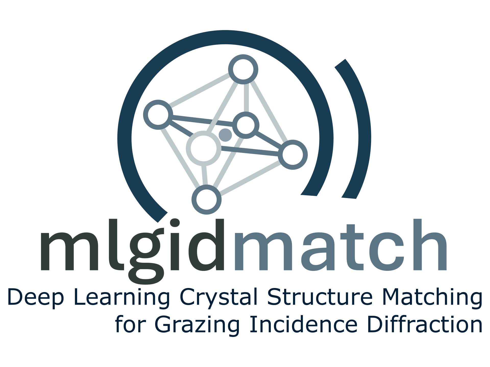

# mlgidMATCH

_mlgidMATCH_ performs peak-to-structure matching of GID patterns.

<p align="center">
  
</p>

The package performs crystal phase identification from (generally, multi-phase) GID patterns based on Bragg peak
positions and their intensities. To validate a measured pattern, the framework requires a set of candidate crystal
structures (generally, the entire crystal database can be supplied).

The framework returns (generally, multiple) set(s) of crystal structures that explain all or most of the measured peaks.
A full description of the matching algorithm process could be found in (`here will be the link to the paper`)

## Installation

### Install from PyPi

```bash
pip install mlgidmatch
```

### Install from source

First, clone the repository:

```bash
git clone https://github.com/mlgid-project/mlgidMATCH.git
```

Then, to install all required modules, navigate to the cloned directory and execute:

```bash
cd pygidMATCH
pip install -e .
```

[//]: # (### Development Installation)

[//]: # ()

[//]: # (For development and testing, install with development dependencies:)

[//]: # ()

[//]: # (```bash)

[//]: # (pip install -e .[dev])

[//]: # (```)

[//]: # ()

[//]: # (## Testing)

[//]: # ()

[//]: # (The project uses pytest for testing. To run the test suite:)

[//]: # ()

[//]: # (```bash)

[//]: # (# Run all tests)

[//]: # (pytest)

[//]: # ()

[//]: # (# Run tests with coverage report)

[//]: # (pytest --cov=mlgidmatch --cov-report=html)

[//]: # ()

[//]: # (# Run tests in parallel)

[//]: # (pytest -n auto)

[//]: # (```)

## Usage

### Preprocessing

Before validation, a preprocessing step is required to convert candidate crystal structures into a neural
network-friendly format. It is recommended to perform this step in advance (e.g., before the experiment), as the
preprocessing may take several minutes.

To preprocess candidate structures, use the `mlgidmatch.preprocess.cif_preprocess.CifPattern` class. This class prepares
all data required for the neural matching stage and the subsequent peak-to-structure matching.

The class requires a folder containing CIF files, specified by the `folder_path` argument. If only a subset of CIF files
from the folder should be used, the `cifs` argument can be provided.

The argument `create_all=True` enables precomputation of patterns for all unique crystal orientations. This option is
recommended only when the number of candidate structures is small (up to ~1000), as it may otherwise lead to excessive
memory usage.

The class also requires experimental parameters for correct preprocessing. These parameters can be created using the
`experiment.ExpParameters` class from the `pygidsim` package, which is available on PyPi.

```python
from mlgidmatch.preprocess.cif_preprocess import CifPattern
from pygidsim.experiment import ExpParameters

# path to the folder with CIF files
folder_path = './cifs/'

# list of CIF files to preprocess (if not provided, all CIFs from the folder will be used)
all_cifs = ['struct1.cif', 'struct2.cif', ...]  # optional

params = ExpParameters(q_xy_max=5, q_z_max=5, en=18_000)  # experimental parameters
cif_prepr = CifPattern(
    params=params,
    folder_path=folder_path,
    cifs=all_cifs,  # optional
    create_all=True,  # optional, default: False
)
```

For future use, it is recommended to save the preprocessed data using pickle format:

```python
import pickle

with open('./mlgidmatch/data/prepr_cifs.pickle', 'wb') as file:
    pickle.dump(cif_prepr, file)
```

To load the preprocessed data later use the following code:

```python
with open('./mlgidmatch/data/prepr_cifs.pickle', 'rb') as file:
    cif_prepr = pickle.load(file)
```

### Neural Matching

To receive only probabilities for the candidate structures from the neural matching stage, use the following example:

```python
from mlgidmatch.matching import Match

match_class = Match(
    model_path='./cif_matching/models/ResNet18_newimage_14ch_state99999.pt',
    cif_prepr=cif_prepr,
    device='cuda',
)

probabilities = match_class.match_cifs(
    peaks=q_2d,  # np.ndarray, shape (peaks_num, 2)
    q_range=(q_xy_max, q_z_max),  # upper limits of q-range
    candidates=[struct1.cif, struct5.cif],  # candidate structures for the measurement (optional)
)
```

### Peak-to-structure matching

To perform full matching, including neural matching, phase identification and peak-to-structure assignment, use the
following example:

```python
from mlgidmatch.matching import Match

match_class = Match(
    cif_prepr=cif_prepr,
    model_path='./cif_matching/models/ResNet18_newimage_14ch_state99999.pt',  # optional
    device='cuda',  # optional
)

# names of the measurements
measurements = ['meas1', 'meas2', ...]

# Peak positions and intensities (own ArrayLike per measurement)
peak_list = [q_2d_1, q_2d_2, ...]
intensities_real_list = [intens1, intens2, ...]

# Upper limits of the q-range (q_xy, q_z)
q_range_list = [(2.7, 2.7), (3.1, 2.5), ...]

# type of the peaks - 'segments' or 'rings'
peaks_type = 'segments'

# Probability threshold (optional)
threshold = 0.5

# Candidate structures for each measurement (optional)
candidates_list = [
    [struct1.cif, struct5.cif],
    [struct2.cif, struct3.cif, struct7.cif],
    ...
],  # Leave empty to use all structures from cif_prepr.cifs

# Matching process
data_matched = match_class.match_all(
    measurements=measurements,
    peak_list=peak_list,
    intensities_real_list=intensities_real_list,
    q_range_list=q_range_list,
    threshold=threshold,  # optional, default: 0.5
    candidates_list=candidates_list,  # optional, Leave empty to use all structures from cif_prepr.cifs
    peaks_type=peaks_type,
)

# Make user-friendly output by removing duplicated solutions (e.g. [DIP + HATCH] and [HATCH + DIP]), 
# description is below in the Output section.
unique_solutions = match_class.unique_solutions(data_matched)
```

To avoid the neural matching stage and perform only peak-to-structure assignment, use threshold = 0.

### Output

After the matching process, `data_matched` is a dictionary with the following hierarchical structure:

```bash
data_matched/
├── <measurement_name>/ # e.g. "meas_1"
│    └── peaks/                        # list of peak positions
│    ├── <phase_1_option_id>/          # integer, first phase index (option 1)
│    │   ├── orient                    # crystal orientation
│    │   ├── probability               # phase probability
│    │   ├── indices_real_matched_all  # indices of the peaks matched to the structure
│    │   │
│    │   ├── <phase_2_option_id>/...   # integer, second phase index (option 1)
│    │   │           └──...
│    │   ├── <phase_2_option_id>/...   # integer, second phase index (option 2)
│    │   │           └──...
... ... ...
│    ├── <phase_1_option_id>/          # integer, first phase index (option 2)
│    │   └──...
│    │   
│    └── ...
│    
└──
```

This output contains complete information about the peak-to-structure matching process. If no valid solutions are found,
the output tree contains only the `peaks` entry.

An example output is shown below:

```python
data_matched = {
    'meas_1': {
        'peaks': np.array(
            [[0.0310, 0.7514],
             [1.7270, 0.9246],
             [0.3772, 2.5963],
             ...]
        ),
        '0': {
            'cif': 'DIP.cif',
            'orient': np.array([0, 0, 1]),
            'probability': 0.985,
            'indices_real_matched_all': np.array([...]),
            '0': {
                'cif': 'HATCH.cif',
                'orient': np.array([1, 0, 1]),
                'probability': 0.685,
                'indices_real_matched_all': np.array([...])
            },
            '1': {
                'cif': 'ZnPc.cif',
                'orient': np.array([1, 1, 1]),
                'probability': 0.792,
                'indices_real_matched_all': np.array([...]),
                '0': {
                    'cif': 'HATCH.cif',
                    'orient': np.array([1, 0, 1]),
                    'probability': 0.582,
                    'indices_real_matched_all': np.array([...])
                }
            }
        },
        '1': {
            'cif': 'HATCH.cif',
            'orient': np.array([1, 0, 1]),
            'probability': 0.991,
            'indices_real_matched_all': np.array([...]),
            '0': {
                'cif': 'DIP.cif',
                'orient': np.array([0, 0, 1]),
                'probability': 0.911,
                'indices_real_matched_all': np.array([...])
            }
        }
    },
    'meas_2': {
        ...
    }
}
```

This result indicates that the framework found three valid phase combinations:

1) `00`: DIP + HATCH
2) `010`: DIP + ZnPc + HATCH
3) `10`: HATCH + DIP

Finally, duplicated solutions (e.g. [DIP + HATCH] and [HATCH + DIP]) can be removed using the
`unique_solutions()` method:

```python
unique_solutions = match_class.unique_solutions(data_matched)
```

An example of the final output where 'meas_1' contains two unique solutions (DIP + HATCH and DIP + ZnPc + HATCH) is
shown below:'

```python
unique_solutions = {
    'meas_1': {
        0: [
            {
                'cif': 'DIP.cif',
                'orientation': np.array([0, 0, 1]),
                'matched_peaks': np.array([0.985, 0, 0, ..., 0.985, 0]),
            },
            {
                'cif': 'HATCH.cif',
                'orientation': np.array([1, 0, 1]),
                'matched_peaks': np.array([0, 0.685, 0, ..., 0.685, 0]),
            },
        ],
        1: [
            {
                'cif': 'DIP.cif',
                'orientation': np.array([0, 0, 1]),
                'matched_peaks': np.array([0.985, 0, 0, ..., 0.985, 0]),
            },
            {
                'cif': 'ZnPc.cif',
                'orientation': np.array([1, 1, 1]),
                'matched_peaks': np.array([0.792, 0, 0.792, ..., 0.792, 0]),
            },
            {
                'cif': 'HATCH.cif',
                'orientation': np.array([1, 0, 1]),
                'matched_peaks': np.array([0, 0, 0.582, ..., 0.582, 0.582]),
            }
        ],
    },

    'meas_2': {[...]}
}
```